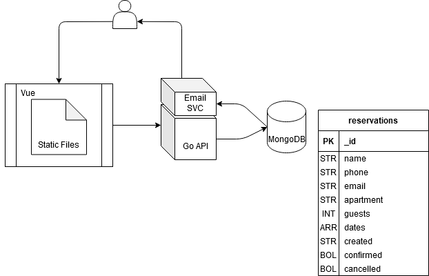

# apartment-site
#### __Author__
Adrian Agnic [ [Github](https://github.com/ajagnic) ]

## Technologies
- [Nuxt.js](https://nuxtjs.org/)
- [Vue.js](https://vuejs.org/)
- [Vuetify](https://next.vuetifyjs.com/en/)
- [Axios](https://axios.nuxtjs.org/)
- [Go](https://golang.org/)
- [MongoDB](https://www.mongodb.com/)

## Local Site Development
```bash
# navigate to site directory
$ cd site/

# install dependencies
$ yarn install

# serve with hot reload at localhost:3000
$ yarn dev
```

## Docker Compose
```bash
# create env variables from example file
$ cp .env.example .env

# start nuxt dev server, api, mongodb and mongo-express
$ docker-compose -f docker-compose.dev.yml up
```

## Architecture with Data Model
